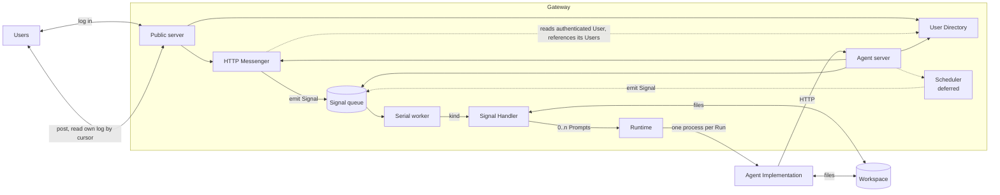

# Architecture

Terminology is defined in [CONTEXT.md](../CONTEXT.md). Decisions and their rationale are in [docs/adr/](./adr/). This document is the map.

## Shape

The Gateway is one deployable application assembled from parts, several of which contribute routes to the Public server, the Agent server, or both. Three rings, from the inside out:

1. **Agent Implementation** — `pi` primarily, `openclaw` as the alternative, driven by a Runtime. In the reference deployment it runs inside a container.
2. **Signal Worker** — the Signal queue, Signal Handler dispatch, Run execution, and Agent server routes for Signals and Runs. Holds no identity and knows nothing about messaging.
3. **Producers** — trusted parts that emit Signals into the Signal Worker: the **HTTP Messenger** for messaging, and the **Scheduler** for time. An Operator picks the ones they want and writes their own where needed. **v1 ships only the HTTP Messenger**; the Scheduler is designed and deferred ([ADR-0018](./adr/0018-scheduling-is-a-separate-component.md)). Messaging is one part making one set of choices rather than the framework's last word on the subject: a deployment wanting a different content shape, `kind` or route layout writes a second messaging Producer as a peer, and pays for it in two Message logs the agent reads separately ([ADR-0034](./adr/0034-the-http-messenger-is-an-opinionated-messenger.md)).

Not every part is a Producer. The **User Directory** owns Users, their Attributes and their Tokens, and contributes routes to both servers, but emits no Signals at all — a Signal per login would put a Run behind every authentication, and the worker is serial ([ADR-0029](./adr/0029-users-are-a-part-of-their-own.md)).

Nothing represents the Gateway itself. There is no plugin system and no registry of parts: the Operator's entry point constructs the Db, the two servers, the Signal Worker, and whichever Producers the deployment wants, wiring them by passing them to each other ([ADR-0021](./adr/0021-the-framework-has-no-plugin-system.md)).

The parts with something to run are **Components** — a `name`, a `start` and a `stop`, and nothing else ([ADR-0031](./adr/0031-parts-that-run-are-components.md)). The entry point writes them as a list, which starts in that order and stops in the reverse of it; a failed start unwinds what had started. Nothing declares a dependency and nothing is resolved, because the parts already hold each other. The rest of the wiring is construction too: a part handed a server registers its routes on that server, and a part with tables registers its migration descriptor with the Db, so `db.migrate()` takes no arguments and `db.start()` refuses to serve a schema the database is behind ([ADR-0032](./adr/0032-components-wire-themselves-at-construction.md)). An assembly is therefore four steps — construct, migrate, order, start — and only the order is the Operator's to reason about.

Users talk to the User Directory and the HTTP Messenger, and to nothing else. They never see a Signal. The Agent Implementation never reaches a User except through the Agent server. That, and nothing more, is what **Shielded** means.

## Parts

Three kinds of row below, and the distinction matters. **Components** are things the entry point constructs *and* puts in its start order, because they have something to run and something to release. **Objects** are constructed and merely held. **Seams** are things supplied *to* an object — a function or a narrow interface, with no lifecycle and no routes of its own.

| Part | Kind | Supplied by | Routes it contributes | Notes |
| --- | --- | --- | --- | --- |
| Db | Component | framework | — | Signals, Runs, and whatever Producers keep. Owns the pool, the `LISTEN` connections and the migrations |
| Public server | Component | Operator | — | the one surface exposed outside; a `Fastify()` the entry point constructs, wrapped in a `serverComponent` that holds its bind address until `start` |
| Agent server | Component | Operator | — | reachable only by the Agent Implementation; a second `Fastify()`, bound loopback in the reference deployment |
| Signal Worker | Component | framework | agent: read prior Signals, read Runs | owns the serial worker; one Run at a time, globally |
| User Directory | object, replaceable | framework | public: log in, log out, change password, read self — agent: create and read Users | Users, their Attributes, and their Tokens. Not a Producer (ADR-0029), and not a Component: nothing to start, nothing to release (ADR-0031) |
| HTTP Messenger | object | framework | public: post a Message, read own Message log; agent: send a Message, read any one User's Message log | one table, one `text` per Message, and a `seq` per User across both directions, so one cursored read serves polling and rendering (ADR-0035). Constructed with the Db, the User Directory, the Signal Worker and **both** servers, all required; owns no Users, and references theirs (ADR-0036). Not a Component: nothing to start, nothing to release |
| Scheduler | object, replaceable | framework | agent: schedule future work | recurrence, cancellation, next-fire. **Deferred, not in v1** (ADR-0018) |
| Runtime | seam | framework or Operator | — | narrow contract: Prompt + Session in, outcome out. The `pi` one spawns a confined process per Run (ADR-0025) |
| Signal Handler | seam | Operator | — | arbitrary code; the primary extension point |
| Workspace | directory | Operator | — | files shared by handlers and agent; global, not per Session |

Anything not in this table an Operator adds themselves: routes as Fastify plugins on either server, and background work as ordinary code that calls the Signal Worker's emit method. Work with a lifecycle of its own is a Component of the Operator's, written as two methods and a name and placed in the same list — nothing about the framework's own Components is privileged.

## The loop

1. A Producer emits a Signal — in v1, the HTTP Messenger, which reads the User the User Directory authenticated, records an inbound Message, and emits the Signal in one transaction.
2. The worker takes the oldest pending Signal.
3. It dispatches on `kind` to exactly one Signal Handler, which returns zero or more Prompts, each naming a Session.
4. For each Prompt the Runtime starts a Run. Under `pi`, one fresh process against the named session.
5. During the Run the agent may call the Agent server: send Messages, read the Message log for any User, read Users, create a User with no Attributes, read prior Signals. It may not grant a User privileges, re-credential one, mint a Token, or remove one (ADR-0029).
6. Outbound Messages are appended to the Message log, each numbered in the same per-User sequence as that User's inbound ones, and a send to a User who does not exist is refused (ADR-0035, ADR-0036).
7. The handler's post phase runs, told whether any Run failed. It may send a Message, which is how "that failed" reaches the person who asked (ADR-0017).
8. Users poll their own Message log by cursor, and it is the same read that renders the conversation: both directions, one sequence, ascending, `?after=<seq>` to resume (ADR-0035).

## Extension points

**Signal Handler** and **Runtime** — both arbitrary code, neither restricted. The **User Directory**, **HTTP Messenger** and **Scheduler** are replaceable by construction: don't build ours, build yours. Two qualifications on that, both the HTTP Messenger's. It is replaceable only *wholesale*: it exports no route plugin and its prefixes are fixed, so an Operator who wants these routes elsewhere or behind a hook of their own writes their own messaging Producer instead ([ADR-0034](./adr/0034-the-http-messenger-is-an-opinionated-messenger.md)). And a deployment that does construct it is tied to *our* User Directory at the schema level rather than the type level, because its `user_id` is a foreign key onto `saf_users.users.id`: a replacement Directory must own that table ([ADR-0036](./adr/0036-the-http-messengers-user-id-is-a-foreign-key.md)). Replacing only *how a User proves who they are*, while keeping our Tokens, is narrower still: write your own login route and call the User Directory's token issuance. That is the seam, and there is no Authenticator interface ([ADR-0030](./adr/0030-passwords-are-traded-for-bearer-tokens.md)). Routes extend through Fastify's plugin system on either server, and further Producers are ordinary code calling the Signal Worker's emit method. There is deliberately no framework-level plugin contract ([ADR-0021](./adr/0021-the-framework-has-no-plugin-system.md)).

## What this framework provides

- No path from a User to the Agent Implementation except through the Gateway.
- Every Signal comes from a trusted Producer. What a Producer puts in a payload is its own contract — the HTTP Messenger's contract is the stored Message, whose User id it wrote itself.
- Every Message involves exactly one User, in one direction, and Users read only their own Message log. Only a User can cause an inbound one: no trusted-code path writes in their name.
- No identifier or counter exposed to a User is influenced by another User's activity.

## What it does not provide

Each is a deliberate decision, not an omission:

- **Confidentiality between Users.** The agent reads everything and decides what to send to whom (ADR-0002, ADR-0011).
- **Injection resistance.** Accepted risk, mitigated by guidance to handler authors (ADR-0003).
- **Agent Implementation confinement.** The deployment's responsibility (ADR-0004).
- **Non-repudiation.** No party can prove what the agent was told or replied (ADR-0001).
- **Isolation of any kind.** A deployment needing real isolation runs two Shared Agents.
- **Protection against a bad Producer.** Producers are trusted by construction (ADR-0020).
- **Availability under a hostile User.** With no timeouts and a serial worker, a User who steers the agent into an unbounded tool loop halts it for every Party until an Operator restarts (ADR-0017).
- **Authentication on the Agent server.** There is none, and reaching the port is access — so keeping it unreachable is the deployment's job, through the bind address its entry point states when it constructs that server's Component (ADR-0004, ADR-0010).
- **Any limit on password guessing.** The login route is unthrottled and no lockout exists. Rate limiting belongs to the deployment's edge, where it survives a second Gateway process; per-User lockout was refused because it hands an attacker a cheaper attack than it prevents (ADR-0030).
- **Account recovery.** No email, no reset flow, no security questions. A forgotten password is trusted code setting a new one (ADR-0014, ADR-0030).
- **Removal of a User.** Nothing deletes or deactivates one. Revoking their Tokens is the whole of it (ADR-0029).

## Known limits

- **One Run at a time, globally.** Throughput is roughly one Run per Run-duration for the whole agent, and a short question queues behind a long task (ADR-0012).
- **Nothing is bounded by time.** No Run timeout, no handler timeout. A hung `bash` call or a wedged handler halts every Party until an Operator restarts the process (ADR-0017).
- **At-most-once processing.** A failed Signal is dropped after partial effect and never re-run.
- **Swapping Agent Implementation means rewriting the agent's configuration** (ADR-0016).
- **The read-side blast radius of a successful injection is everything the agent-facing API exposes** (ADR-0011).

## Open

- Why `pi` was chosen over `openclaw`, which already provides much of this (ADR-0005).
- Whether the User Directory, HTTP Messenger and Scheduler stay parts of one deployable or become peer services later (ADR-0020). The foreign key between the first two is a new argument for one deployable (ADR-0036).
- Whether removal of a User ever returns, and in what form (ADR-0029).
