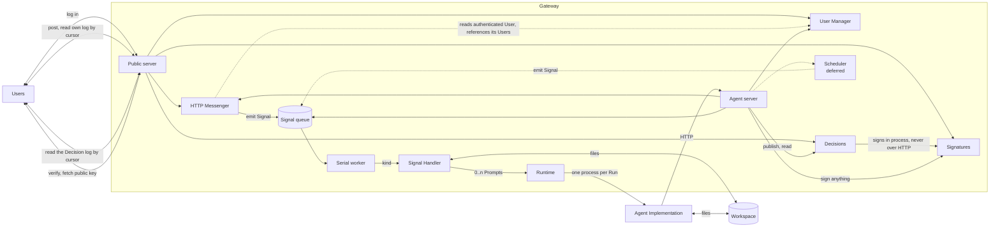

# Architecture

Terminology is defined in [CONTEXT.md](../CONTEXT.md). Decisions and their rationale are in [docs/adr/](./adr/). This document is the map.

## Shape

The Gateway is one deployable application assembled from parts, several of which contribute routes to the Public server, the Agent server, or both. Three rings, from the inside out:

1. **Agent Implementation** — `pi` primarily, `openclaw` as the alternative, driven by a Runtime. In the reference deployment it runs inside a container.
2. **Signal Worker** — the Signal queue, Signal Handler dispatch, Run execution, and Agent server routes for Signals and Runs. Holds no identity and knows nothing about messaging.
3. **Producers** — trusted parts that emit Signals into the Signal Worker: the **HTTP Messenger** for messaging, and the **Scheduler** for time. An Operator picks the ones they want and writes their own where needed. **v1 ships only the HTTP Messenger**; the Scheduler is designed and deferred ([ADR-0018](./adr/0018-scheduling-is-a-separate-component.md)). Messaging is one part making one set of choices rather than the framework's last word on the subject: a deployment wanting a different content shape, `kind` or route layout writes a second messaging Producer as a peer, and pays for it in two Message logs the agent reads separately ([ADR-0034](./adr/0034-the-http-messenger-is-an-opinionated-messenger.md)).

Not every part is a Producer. The **User Manager** owns Users, their Attributes and their Tokens, and contributes routes to both servers, but emits no Signals at all — a Signal per login would put a Run behind every authentication, and the worker is serial ([ADR-0029](./adr/0029-users-are-a-part-of-their-own.md)). **Signatures** and **Decisions** are the same for the same arithmetic: a Decision is published *during* a Run, so emitting a Signal from it would have the agent queue work for itself on a serial worker, and the Handler it woke could publish again ([ADR-0043](./adr/0043-decisions-are-one-global-log.md)).

**Signatures** holds the Shared Agent's signing identity and is the one Component with no tables at all. A Shared Agent's keypair *is* its identity; the Operator holds the private half in trust, which is the trust [ADR-0001](./adr/0001-the-gateway-is-trusted.md) already grants applied to one more asset, and the key never enters the Agent Container ([ADR-0041](./adr/0041-the-shared-agent-has-a-signing-identity.md)). What it makes is a **Signed Statement**: a compact JWS, one URL-safe string, verifiable by off-the-shelf JOSE tooling in any language and built here with `jose`, which is a runtime dependency of this Component and of nothing else ([ADR-0042](./adr/0042-a-signature-is-a-compact-jws.md)). **Decisions** is the log of the ones worth keeping — global, addressed to nobody, published by the agent and read by any authenticated User, because a commitment that is not public is not a commitment.

What a signature proves is narrow and should be read as written: **that the Operator committed to this Statement on the Shared Agent's behalf, and nothing whatever about the agent's conduct.** Its audience is a party who never touches the Gateway's API and holds only a public key.

A **Gateway** is a record of Components keyed by the Operator's own words, which starts in key order, stops in the reverse of it, and unwinds a failed start; what `createGateway(record)` returns is itself a Component ([ADR-0037](./adr/0037-the-gateway-is-a-record-of-components.md)). It is still not a plugin system and still not a registry: a **Component** is a `start` and a `stop` and nothing else — no name, no declared dependency and nothing resolved — because the parts already hold each other, having been passed to each other ([ADR-0021](./adr/0021-the-framework-has-no-plugin-system.md)). The rest of the wiring is construction too: a part handed a server registers its routes on that server, and a part with tables registers its migration descriptor with the Db, so `db.migrate()` takes no arguments and `db.start()` refuses to serve a schema the database is behind ([ADR-0032](./adr/0032-components-wire-themselves-at-construction.md)).

`createGatewayWithDefaults` is the canonical path: one call builds the Db, both servers, the User Manager, the HTTP Messenger, Signatures, Decisions and the Signal Worker, wires them, and keys them in the one order that works — the Signal Worker's `stop` is the only stop that does work, so the drain runs first, while every server is still listening and the pool is still open ([ADR-0038](./adr/0038-the-default-assembly-is-a-constructor.md)). An assembly is therefore three steps — construct, migrate, start — and none of them is an ordering decision. An Operator who needs a different answer writes `createGateway` with a record of their own, which is a whole-or-nothing escape rather than a partial one.

Users talk to the User Manager, the HTTP Messenger, Decisions and two of Signatures' three routes, and to nothing else. They never see a Signal, and they never reach `POST /sign` — minting is the agent's alone. The Agent Implementation never reaches a User except through the Agent server. That, and nothing more, is what **Shielded** means.

## Components

Every part a deployment is assembled from is a **Component**, and the eight that exist are listed below in the order they start; they stop in the reverse of it. Four of them have nothing to run and say so with a `start` and a `stop` that do nothing, which is what buys them a key and a position before the day they need one ([ADR-0037](./adr/0037-the-gateway-is-a-record-of-components.md)). The Scheduler is the last row and is in no order at all, having no key and no code.

| Component | Key | Supplied by | Routes it contributes | Notes |
| --- | --- | --- | --- | --- |
| Db | `db` | framework | — | Signals, Runs, and whatever Producers keep. Owns the pool, the `LISTEN` connections and the migrations. Starts first and stops last, because everything queries it and the drain queries it on the way down |
| Agent server | `agentServer` | framework, address from the Operator | — | reachable only by the Agent Implementation; a bare `Fastify()` wrapped in a `serverComponent` that holds its bind address until `start`, bound loopback in the reference deployment |
| Public server | `publicServer` | framework, address from the Operator | — | the one surface exposed outside; the second `Fastify()`, same wrapper. Grouped with the Agent server rather than stopped ahead of it, so both outlive the drain (ADR-0038) |
| User Manager | `users` | framework, replaceable | public: log in, log out, change password, read self — agent: create and read Users | Users, their Attributes, and their Tokens. Not a Producer (ADR-0029). Nothing to start and nothing to release, so both methods do nothing |
| HTTP Messenger | `messenger` | framework | public: post a Message, read own Message log; agent: send a Message, read any one User's Message log | one table, one `text` per Message, and a `seq` per User across both directions, so one cursored read serves polling and rendering (ADR-0035). Constructed with the Db, the User Manager, the Signal Worker and **both** servers, all required; owns no Users, and references theirs (ADR-0036). Both methods do nothing today, and its position already anticipates the day delivery stops being polling |
| Signatures | `signatures` | framework | public: verify a Signed Statement, fetch the public key — agent: sign anything | holds the signing identity and **no tables at all**, the only Component with none. `signingKey` is a `crypto.KeyObject` the Operator loads however they like; `signingAlg` is derived from its JWK export (`EdDSA` for Ed25519, `ES256`/`ES384`/`ES512` for the NIST curves) and is required for an RSA key, which six algorithms are valid for. Any other key is refused as the Gateway is constructed, in a sentence naming what to pass. Stores nothing, so signing is unrecorded beyond a log line (ADR-0041, ADR-0042) |
| Decisions | `decisions` | framework | public: read the log by cursor, read one by `seq` — agent: publish, and the same reads | one table, four columns, one global `seq`, and the framework's only **shared** read: every User sees the same rows. Constructed with the Db, Signatures and both servers; signs **in process** and never over HTTP. References no Users, so it imposes no construction order (ADR-0043) |
| Signal Worker | `worker` | framework | agent: read prior Signals, read Runs | owns the serial worker; one Run at a time, globally. **The only `stop` that does work**: it waits for the Run in flight, which is why it is keyed last and therefore drains first (ADR-0038) |
| Scheduler | — | framework, replaceable | agent: schedule future work | recurrence, cancellation, next-fire. **Deferred, not in v1** (ADR-0018) |

An Operator's own Components go in the same record through `extend`, appended, so they start last and stop first — right for a Producer, wrong for a resource the drain uses, and the answer to the second is writing `createGateway` by hand (ADR-0038). Nothing about the framework's own is privileged.

Three things in the design are **not** Components, and each is a different reason why.

| Not a Component | Kind | Supplied by | Notes |
| --- | --- | --- | --- |
| Runtime | seam | framework or Operator | narrow contract: Prompt + Session in, outcome out. Held *by* the Signal Worker and never started, which is what lets a second Agent Implementation be one function (ADR-0025, ADR-0033) |
| Signal Handler | seam | Operator | arbitrary code; the primary extension point. Receives only the Signal (ADR-0024) |
| Workspace | directory | Operator | files shared by handlers and agent; global, not per Session. Not a value the framework holds at all — it is a Mount Table entry and a path |

Anything else an Operator adds themselves: routes as Fastify plugins on either server, and background work as ordinary code that calls the Signal Worker's emit method.

## The loop

1. A Producer emits a Signal — in v1, the HTTP Messenger, which reads the User the User Manager authenticated, records an inbound Message, and emits the Signal in one transaction.
2. The worker takes the oldest pending Signal.
3. It dispatches on `kind` to exactly one Signal Handler, which returns zero or more Prompts, each naming a Session.
4. For each Prompt the Runtime starts a Run. Under `pi`, one fresh process against the named session.
5. During the Run the agent may call the Agent server: send Messages, read the Message log for any User, read Users, create a User with no Attributes, read prior Signals, **publish a Decision, read the Decision log, and have any string signed**. It may not grant a User privileges, re-credential one, mint a Token, or remove one (ADR-0029). It never holds the signing key (ADR-0041).
6. Outbound Messages are appended to the Message log, each numbered in the same per-User sequence as that User's inbound ones, and a send to a User who does not exist is refused (ADR-0035, ADR-0036).
7. The handler's post phase runs, told whether any Run failed. It may send a Message, which is how "that failed" reaches the person who asked (ADR-0017).
8. Users poll their own Message log by cursor, and it is the same read that renders the conversation: both directions, one sequence, ascending, `?after=<seq>` to resume (ADR-0035). They poll the **Decision log** the same way, and it is the same read for everyone — nothing notifies them, since Decisions emits no Signal (ADR-0043).
9. A User who wants a Decision checked either asks the Gateway, which is a convenience they have to believe, or fetches the public key and checks it themselves — and hands the artifact to a third party who does the same. That hand-off, out of band and outside the Gateway, is what the signature exists for (ADR-0042).

## Extension points

**Signal Handler** and **Runtime** — both arbitrary code, neither restricted. The **User Manager**, **HTTP Messenger**, **Signatures**, **Decisions** and **Scheduler** are replaceable by construction: don't build ours, build yours. Signatures is the one where that is likely to be wanted, since a deployment holding its identity in an HSM cannot use ours at all — a non-exportable hardware key has no `KeyObject`, and there is no signer-function seam to reach for (ADR-0042). Replacing Signatures alone means keeping Decisions, which holds it as a constructor argument and calls one method on it. That means leaving `createGatewayWithDefaults`, which builds the first two and forbids their keys in what `extend` returns, precisely so that a substitution cannot be silent ([ADR-0038](./adr/0038-the-default-assembly-is-a-constructor.md)). Two further qualifications, both the HTTP Messenger's. It is replaceable only *wholesale*: it exports no route plugin and its prefixes are fixed, so an Operator who wants these routes elsewhere or behind a hook of their own writes their own messaging Producer instead ([ADR-0034](./adr/0034-the-http-messenger-is-an-opinionated-messenger.md)). And a deployment that does construct it is tied to *our* User Manager at the schema level rather than the type level, because its `user_id` is a foreign key onto `saf_users.users.id`: a replacement User Manager must own that table ([ADR-0036](./adr/0036-the-http-messengers-user-id-is-a-foreign-key.md)). Replacing only *how a User proves who they are*, while keeping our Tokens, is narrower still: write your own login route and call the User Manager's token issuance. That is the seam, and there is no Authenticator interface ([ADR-0030](./adr/0030-passwords-are-traded-for-bearer-tokens.md)). Routes extend through Fastify's plugin system on either server, and further Producers are ordinary code calling the Signal Worker's emit method. There is deliberately no framework-level plugin contract ([ADR-0021](./adr/0021-the-framework-has-no-plugin-system.md)).

## What this framework provides

- No path from a User to the Agent Implementation except through the Gateway.
- Every Signal comes from a trusted Producer. What a Producer puts in a payload is its own contract — the HTTP Messenger's contract is the stored Message, whose User id it wrote itself.
- Every Message involves exactly one User, in one direction, and Users read only their own Message log. Only a User can cause an inbound one: no trusted-code path writes in their name.
- No identifier or counter exposed to a User is influenced by another User's activity, **on a per-User surface**. The Decision log is deliberately shared and is the one exception (ADR-0043).
- A Shared Agent has one identity, the private half never leaves the Gateway, and stopping the Gateway stops all signing. What that buys is bounded and stated in ADR-0041 rather than implied.

## What it does not provide

Each is a deliberate decision, not an omission:

- **Confidentiality between Users.** The agent reads everything and decides what to send to whom (ADR-0002, ADR-0011).
- **Injection resistance.** Accepted risk, mitigated by guidance to handler authors (ADR-0003).
- **Agent Implementation confinement.** The deployment's responsibility (ADR-0004).
- **Non-repudiation of the conversation.** No party can prove what the agent was told or replied (ADR-0001). Signed Statements do not change this and are not an exception to it: a signature proves that the Operator committed to one string, not what any Party said, not what the agent was asked, and not that a Decision was reached honestly. **Nothing here is evidence about the agent's conduct** (ADR-0041).
- **Any guarantee that a Signed Statement was mediated.** The agent can have any string signed, with no row and no Signal, and nothing records it beyond a log line carrying a digest. An injected agent mints artifacts freely; what it cannot do is take the key with it (ADR-0003, ADR-0042).
- **Detection of a withheld Decision.** A gap in `seq` means a rolled-back transaction, and the Operator owns the database, so withholding is undetectable under any numbering. That needs a hash chain or a transparency log, which ADR-0001 rejected (ADR-0043).
- **Key rotation.** One keypair, no identifier on any record, and nothing generates or stores one. Rotating leaves the log verifiable only against a public key held out of band (ADR-0041).
- **Isolation of any kind.** A deployment needing real isolation runs two Shared Agents.
- **Protection against a bad Producer.** Producers are trusted by construction (ADR-0020).
- **Availability under a hostile User.** With no timeouts and a serial worker, a User who steers the agent into an unbounded tool loop halts it for every Party until an Operator restarts (ADR-0017).
- **Authentication on the Agent server.** There is none, and reaching the port is access — so keeping it unreachable is the deployment's job, through the bind address its entry point states when it asks for that server (ADR-0004, ADR-0010).
- **Any limit on password guessing.** The login route is unthrottled and no lockout exists. Rate limiting belongs to the deployment's edge, where it survives a second Gateway process; per-User lockout was refused because it hands an attacker a cheaper attack than it prevents (ADR-0030).
- **Account recovery.** No email, no reset flow, no security questions. A forgotten password is trusted code setting a new one (ADR-0014, ADR-0030).
- **Removal of a User.** Nothing deletes or deactivates one. Revoking their Tokens is the whole of it (ADR-0029).

## Known limits

- **One Run at a time, globally.** Throughput is roughly one Run per Run-duration for the whole agent, and a short question queues behind a long task (ADR-0012).
- **Nothing is bounded by time.** No Run timeout, no handler timeout. A hung `bash` call or a wedged handler halts every Party until an Operator restarts the process (ADR-0017).
- **At-most-once processing.** A failed Signal is dropped after partial effect and never re-run.
- **Swapping Agent Implementation means rewriting the agent's configuration** (ADR-0016).
- **The read-side blast radius of a successful injection is everything the agent-facing API exposes** (ADR-0011).

## Open

- Why `pi` was chosen over `openclaw`, which already provides much of this (ADR-0005).
- Whether the User Manager, HTTP Messenger and Scheduler stay parts of one deployable or become peer services later (ADR-0020). The foreign key between the first two is a new argument for one deployable (ADR-0036).
- Whether removal of a User ever returns, and in what form (ADR-0029).
- Whether a signer-function seam returns for HSM and KMS keys, which the `KeyObject` option cannot express (ADR-0042).
- Whether a `key_id` on a Decision, or key rotation at all, is worth its machinery. The cost of not having it is recorded and unmitigated (ADR-0041).
- Whether the User Manager's rename to **Users** lands as ADR-0044 says, and what else moves with it.
